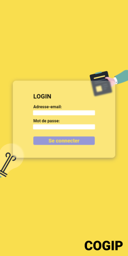
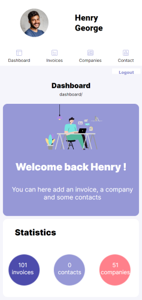
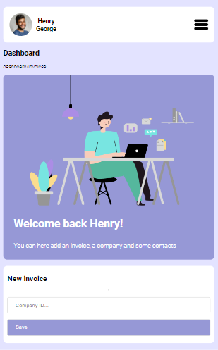

# COGIP project

This project was realized during our web development training at BeCode in February 2023.







## Team

- [Benjamin](https://github.com/BenPrst) : front-end
- [Dominique](https://github.com/DCoppee) : front-end
- [Mathilde](https://github.com/MathildeCornelis) : front-end
- [Milo](https://github.com/Milo-star) : back-end
- [Pierre](https://github.com/Gollumeo) : back-end (project manager)

## What is COGIP ?

The COGIP is a company which we don't know a lot about apart that they produce Jean-Michel toys and that they are serious workers check. They also have incredible employees within their rank.

## Missions

Our general mission was to code a web application to manage all the COGIP data.

### Back-end

  - Install all the dependencies using composer
  - Learning PHP (POO), MVC Structure
  - CRUD
  - Form Validation & Sanitization
  - Database management

### Front-end

  - Respect the given mockup
  - Mobile First
  - Using npm
  - Google Ligthouse Test
  - Semantics

## App description (fonctionnalités, langages)

### Languages and employed technologies

#### Languages, principles & Frameworks
- PHP
  - OOP
  - Namespaces
  - MVC
  - RESTFul APIs
- SQL
  - PDO
- HTML
- SASS
- React

#### Libraries

- Bramus Router
- Filp/Whoops
- PHPFaker
- PHPDotEnv
- CarbonDate
- React Pagination

### Features

The Welcome page displays the list of the last 5 invoices (ordered by date), of the last 5 contacts and of the last 5 companies encoded in the database.
This page also displays a link to the providers page and another one to the client page.

The Companies page display a list of all companies in alphabetical order.

The Invoices page displays a list of all the invoices from the most recent to the oldest.

The Contacts page displays a list of all the contacts in alphabetical order.

The Dashboard page displays direct access to the last five invoices (number invoice, date, company), last five companies (company name, its type) and last five contacts (first and last name, email, company name).

## Installation

### Prerequisites

You must have installed on your computer:
- PHP
- Composer
- React
- Node.Js (npm)

Clone this repository: 
```bash
git clone https://github.com/gollumeo/cogip.git
```

### Back-end

Install all the dependencies using composer:
```bash
composer install
```

Separate the backend folder, so you can access the API directly from the browser.
Run the PHP Server:
```bash
php -S localhost:8000 -t public
```

Or you can access it from the hosted [website](https://cogip-api.pierre-mauriello.be/invoices) directly.
Don't forget to refer to the [API documentation](./endpoints.md)!

### Front-end

Install all the dependencies using npm:
```bash
npm install
```

Run the React Server:
```bash
npm run lh
```

Have fun browsing!

And if you ever want to build your own version of the app, you can run:
```bash
npm run build-r
```

Now you can serve it with a static server:
```bash
npm install -g serve
serve -s build
```

I hope you enjoy our project! :smile:

We are, of course, open to issues and improvements, so feel free to contribute!

